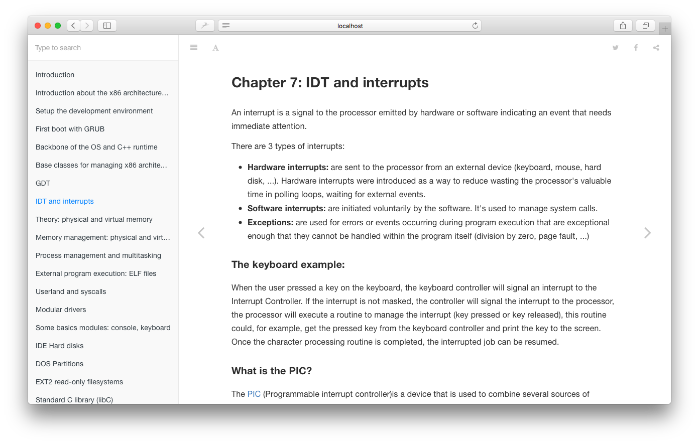

# HonKit Default Theme with FontAwesome 5

This is the default theme for HonKit.

It can be used as a template for theming books or can be extended.



## License

Apache License

Also, This theme includes GitBook default theme codes.
These are also Apache License.

- https://github.com/GitbookIO/theme-default


## Fork of @honkit/theme-default

honkit-plugin-theme-default-fa5 is a fork of https://github.com/honkit/honkit.

This plugin has following features.

- Enable FontAwesome 5
- Change "burger menu" icon
- Add configuration for "burger menu" icon

## Setup

Before building book, add following setting in `book.json`
```js
{
	"plugins": [
		"-theme-default",
		"theme-default-fa5"
	]
}

```

## Costomize Icon

Specify icon classname like following.
You can use FontAwesome 5.

```js
{
	"pluginsConfig": {
		"theme-default-fa5": {
			"iconClass": "fas fa-home"
		}
	}
}
```
